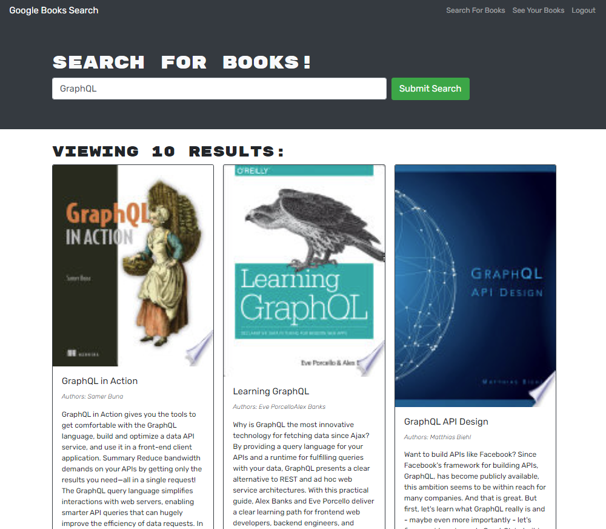

# book_search
Code refactor - GraphQL built with Apollo Server
[](https://opensource.org/licenses/MIT)

  ## Description
  This project consists of a code refactor. The application is a Google Books API search engine that was built with RESTfull API and it was refactored to use GraphQL API built with Apollo Server.
 
 

  ## Table of Contents
  - [Installation](#installation)
  - [Usage](#usage)
  - [Features](#features)
  - [License](#license)
  - [Contributing](#contributing)
  - [Tests](#tests)
  - [Questions](#questions)
  - [Credits](#credits)
  
  ## Installation
  Before running the command line application, please make sure to run `npm i` in the terminal to install all the following packages:
   - Server:
  "apollo-server-express", "express","graphql", "bcrypt", "express", "jsonwebtoken", "mongoose", "nodemon"
   - Client:
  "@apollo/client", "@testing-library/jest-dom", "@testing-library/react", "@testing-library/user-event", "bootstrap", "graphql", "jwt-decode", "react", "react-bootstrap", "react-dom", "react-router-dom", "react-scripts"

  ## Usage
  Book search engine enables the user to search for books and save them on their own page. Once a book is searched, the user can see the book's title, author, description, image and a link to that book on the Google Books site.

  ## Features
  Books can be saved and deleted from the user's account. User needs to sign up in order to save the books.

  

  ## License
  [](https://opensource.org/licenses/MIT)
  
  This application is covered by MIT license, available at:
  https://opensource.org/licenses/MIT

  ## Contributing
  Please feel free to send a pull request, the following is my GitHub account: https://github.com/Renatatims

  ## Tests
  To run the application:
  ````npm run develop ````

  ## Questions
  If you have any questions please contact me at:
   - GitHub account:https://github.com/Renatatims
   - e-mail account: renatatims@gmail.com

  ## Credits
  https://www.apollographql.com/docs/apollo-server/schema/schema, https://www.apollographql.com/docs/apollo-server/deployment/heroku